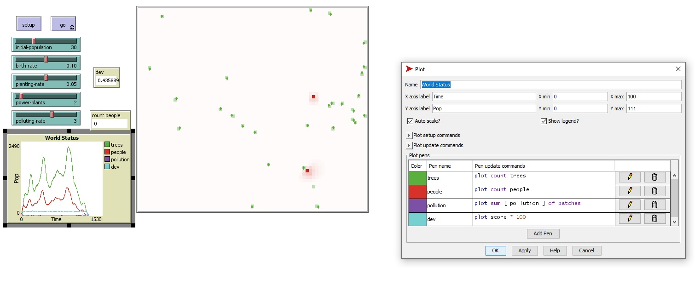
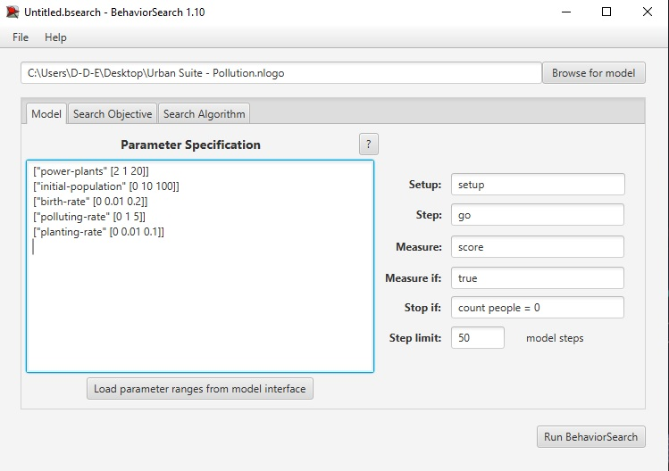
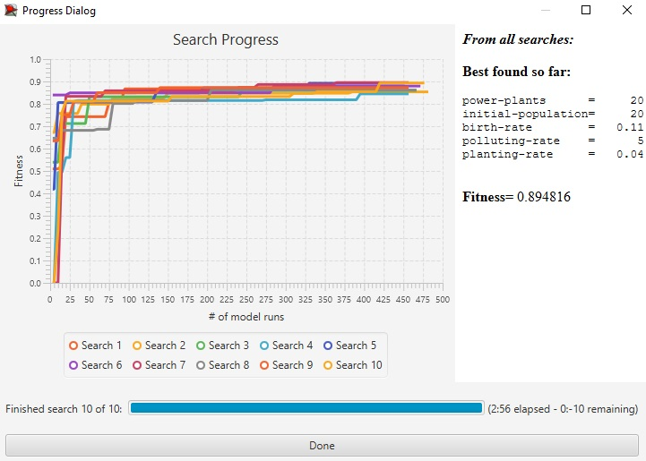
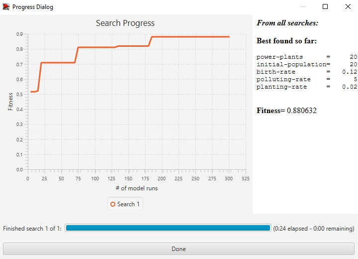

## Імітаційне моделювання комп'ютерних систем

## СПм-21-2, Дашков Дмитро Євгенович

### Лабораторная работа №**3**


## Urban Suite - Pollution

### Модель:

[pollution](http://www.netlogoweb.org/launch#http://www.netlogoweb.org/assets/modelslib/Curricular%20Models/Urban%20Suite/Urban%20Suite%20-%20Pollution.nlogo)

### Вербальное описание модели :

Вербальное описание модели було представленно в ЛБ№3

### Настройки среды BehaviorSearch:

**Параметры модели**:

```
["power-plants" [2 1 20]]
["initial-population" [0 10 100]]
["birth-rate" [0 0.01 0.2]]
["polluting-rate" [0 1 5]]
["planting-rate" [0 0.01 0.1]]
```

Минимальное число енергостанций было увеличенно до 2, по сравнению с изначальным.

Для фитнес-функции была выбрана функция стандартной дивиации здоровья людей:

```
if count people > 2 [
  set score standard-deviation [health] of people
]
```



Для функции дивиации необходимо минимум два значения, для этого было добавленно условие предупреждения ошибки исполнения.

Параметры "**Setup**" и "**Go**" указывают соответствующие процедуры инициализации и запуска в логике модели. Условие "**Stop if**" устанавливет симуляцию когда людей не осталось.

**Настройки целевой функции** (Search Objective):



Целью подбора параметров имитационной модели, является максимизация значения уровня здоровья людей и как следствия уровня их популяции, "**Goal**" учтановлен в **Maximize Fitness**. Для этого в параметре "**Collected measure**", определяющем учет значений выбранного показателя, укзано **MEAN_ACROSS_STEPS**. Воизбежание искажения результатов из-за случайных значений, используемых в логике самой имитационной модели, **каждая симуляция повторяется по 10 раз**, результирующее значение расчитывается как **среднее арифметическое**.

**Настройки алгоритма поиска** (Search Algorithm):
На этом этапе была определена модель, настроены её параметры, и выбрана мера эффективности, лежащая в  основе функции приспособленности, позводяющей оценить "качество" каждого из проверяемого BehaviorSearch варианта решения. В ходе исследования на лабораторной работе используются два алгоритма: Случайный поиск (**RandomSearch**) и Простой генетический алгоритм (**StandardGA**). Для этих алгоритмов, решающих задачу поиска такого набора параметров  имитационной модели, чтобы удоволетворить требования пользователя (в  нашем случае - максимизировать значение средней скорости перемещения  агентов в заданной имитационной модели), необходимо указать

### Результаты использования BehaviorSearch:

Результат поиска параметров имитационной модели, используя **генетический алгоритм**:



Результат поиска параметров имитационной модели, используя **случайный поиск**:

